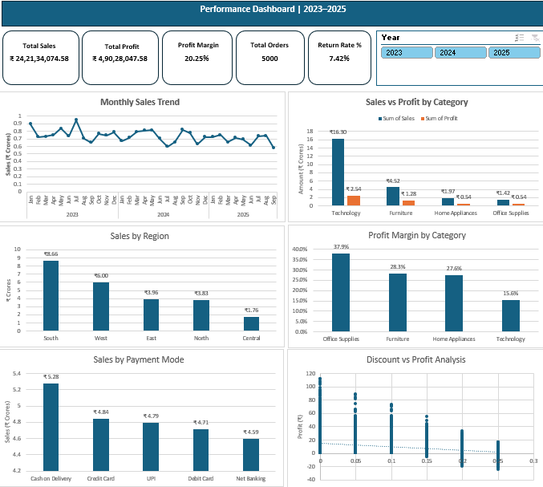

# Retail Sales Analytics | Excel Dashboard Project

## Project Overview

This project is an end-to-end **Retail Sales Analytics solution developed in Microsoft Excel** to analyze transactional retail data from **2023–2025**.

The project transforms raw transaction-level data into an interactive management dashboard using data cleaning, Excel formulas, PivotTables, PivotCharts, KPI calculations, slicers, data validation, and business analysis.

The objective is to help business stakeholders understand **sales performance, profitability, regional performance, category performance, customer purchasing behavior, returns, payment preferences, and the impact of discounting on profit**.

---

## Dashboard Preview



---

## Business Problem

Retail management needs a consolidated view of business performance to answer questions such as:

- How much revenue and profit is the business generating?
- What is the overall profit margin?
- How are sales changing over time?
- Which product categories generate the most revenue?
- Which categories generate the strongest margins?
- Which regions contribute the most sales?
- Which payment methods are most commonly associated with sales?
- What percentage of orders are returned?
- How do discounts affect profitability?

This project converts raw retail transactions into actionable business insights through an interactive Excel dashboard.

---

## Dataset

The dataset contains retail transaction information covering the **2023–2025** analysis period.

Major fields include:

- Order ID
- Order Date
- Ship Date
- Customer
- Product
- Category
- Sub-Category
- Region
- Sales
- Quantity
- Discount
- Cost
- Profit
- Payment Mode
- Shipping Mode
- Returned Status

The raw dataset is available in the [`Dataset`](Dataset/) folder.

---

## Tools & Technologies

- Microsoft Excel
- Excel Tables
- Excel Formulas
- PivotTables
- PivotCharts
- Slicers
- Data Cleaning
- Data Validation
- KPI Analysis
- Dashboard Design
- Business Analysis

---

## Project Workflow

The project follows a complete analytics workflow:

**Raw Data → Data Understanding → Data Cleaning → Data Validation → KPI Calculation → PivotTable Analysis → PivotCharts → Interactive Dashboard → QA Testing → Business Insights → Recommendations**

---

## Data Cleaning & Preparation

Before performing the analysis, the dataset was reviewed and prepared for reporting.

Key activities included:

- Checking missing and blank values
- Reviewing duplicate records
- Validating numerical fields
- Standardizing categorical values
- Validating order and shipping dates
- Checking sales, cost, discount, and profit fields
- Reviewing return-status values
- Creating a clean analysis-ready dataset
- Validating PivotTable results against calculated KPIs

---

## Key Performance Indicators

| KPI | Result |
|---|---:|
| Total Sales | ₹24.21 Cr |
| Total Profit | ₹4.90 Cr |
| Profit Margin | 20.25% |
| Total Orders | 5,000 |
| Return Rate | 7.42% |

These KPIs provide an executive-level summary of overall retail performance.

---

## Dashboard Analysis

The interactive Excel dashboard contains the following analytical views:

### Monthly Sales Trend
Tracks sales performance across 2023–2025 and helps identify monthly fluctuations and changes in revenue.

### Sales vs Profit by Category
Compares category-level revenue with profit to identify categories that generate high sales but potentially weaker margins.

### Sales by Region
Evaluates geographical sales contribution and highlights stronger and weaker-performing regions.

### Profit Margin by Category
Compares category profitability rather than relying only on revenue performance.

### Sales by Payment Mode
Analyzes sales contribution across different customer payment methods.

### Discount vs Profit Analysis
Examines the relationship between discount levels and profitability to identify the potential impact of aggressive discounting.

---

## Interactive Dashboard Features

The dashboard includes:

- Dynamic KPI cards
- Interactive **Year slicer (2023–2025)**
- Connected PivotTables and PivotCharts
- Dynamic filtering
- Monthly trend analysis
- Category comparison
- Regional analysis
- Profitability analysis
- Payment-mode analysis
- Discount-profit relationship analysis

Selecting a year dynamically updates the connected dashboard components.

---

## Key Business Insights

### 1. Overall Performance
The business generated approximately **₹24.21 Cr in sales** and **₹4.90 Cr in profit**, resulting in an overall profit margin of approximately **20.25%**.

### 2. Category Performance
**Technology** generated the highest sales at approximately **₹16.30 Cr**, making it the largest revenue-contributing category.

### 3. Category Profitability
**Office Supplies** recorded the highest category profit margin at approximately **37.9%**.

### 4. Regional Performance
The **South region** generated the highest sales at approximately **₹8.66 Cr**.

### 5. Payment Analysis
**Cash on Delivery** generated the highest sales at approximately **₹5.28 Cr**.

### 6. Returns
The overall return rate was approximately **7.42%**, indicating an area that should continue to be monitored operationally.

### 7. Discount Impact
The Discount vs Profit analysis indicates a **negative relationship between higher discount levels and profit**, suggesting that aggressive discounting should be evaluated carefully.

---

## Business Recommendations

### Protect Technology Revenue
Technology is the largest sales contributor. Inventory availability, product mix, customer demand, and product-level performance should therefore be monitored closely.

### Improve Technology Profitability
Despite leading sales, Technology has the lowest category profit margin at approximately **15.6%**. Product costs, pricing strategy, and discounting should be investigated.

### Expand High-Margin Office Supplies Opportunities
Office Supplies has the strongest category margin at approximately **37.9%**, making it an important area for profitable growth opportunities.

### Investigate Weaker Regions
Sales performance varies considerably across regions. Lower-performing regions should be reviewed for differences in product availability, customer acquisition, market demand, and sales execution.

### Control Discounting
Because profitability generally decreases as discount levels increase, discounts should be evaluated against margin impact instead of being used solely to increase sales volume.

---

## Repository Structure

```text
Retail-Sales-Analytics-Excel/
│
├── Dataset/
│   ├── Excel_Retail_Analytics_Raw_Dataset.xlsx
│   └── README.md
│
├── Excel-Dashboard/
│   ├── Retail_Sales_Analytics_Excel_Dashboard.xlsx
│   └── README.md
│
├── Screenshots/
│   ├── Retail_Sales_Analytics_Dashboard.png
│   └── README.md
│
└── README.md
